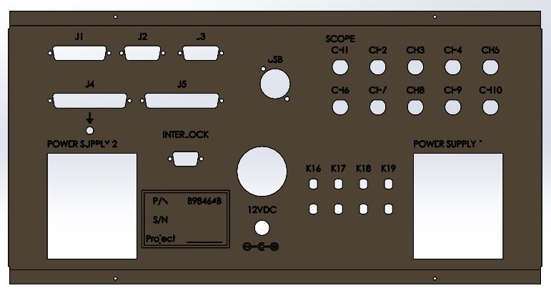

# General Tester Box for Electronic Circuits

The General Tester Box project aims to create a versatile housing unit for electronic circuits, equipped with various components essential for testing and connectivity.

## Images

## Components Included:

- **Two 432W Power Supplies**: Capable of providing stable power to the electronic circuits under test.
- **28 LEDs**: Used for indicating various states or functionalities of the tested circuit.
- **Switch Activated by Key**: Enhances security and control over the operation of the tester box.
- **Connectors**:
  - **USB**: For connecting compatible devices or facilitating data transfer.
  - **DC**: Supporting direct current connections.
  - **2 D-Sub 15**: Commonly used for VGA connections and other applications.
  - **1 D-Sub 25**: Offers a larger number of pins for diverse connectivity.
  - **2 D-Sub 37**: More pins for expanded connectivity options.
  - **D-Sub 9**: Suitable for serial and other communication interfaces.
  - **4 Banana Jacks (Black) and 4 Red**: For easy electrical connections.
  - **BNC**: Bayonet Neill-Concelman connector for RF applications.
  - **Ground**: Essential for grounding the circuits and maintaining safety.

## Purpose:

The General Tester Box serves as a comprehensive platform to assemble, test, and interact with electronic circuits. Its diverse range of connectors and components makes it adaptable for various testing scenarios, providing flexibility and ease of use for engineers, hobbyists, and professionals working with electronic systems.

## Usage:

- Connect the electronic circuit to the desired ports and power supplies.
- Utilize the LEDs for visual feedback on the circuit's status.
- Ensure the proper activation of the switch via the provided key for secure operation.
- Use the variety of connectors to establish different types of connections as required by the circuit under test.

## Contributors:

This project was developed and contributed to by Dr Gal Ben David and Alon Omer Ben David.

## Company:

This project is under the company Dr. Gal Ben-David DSP ltd. Last Updated in 6/12/23